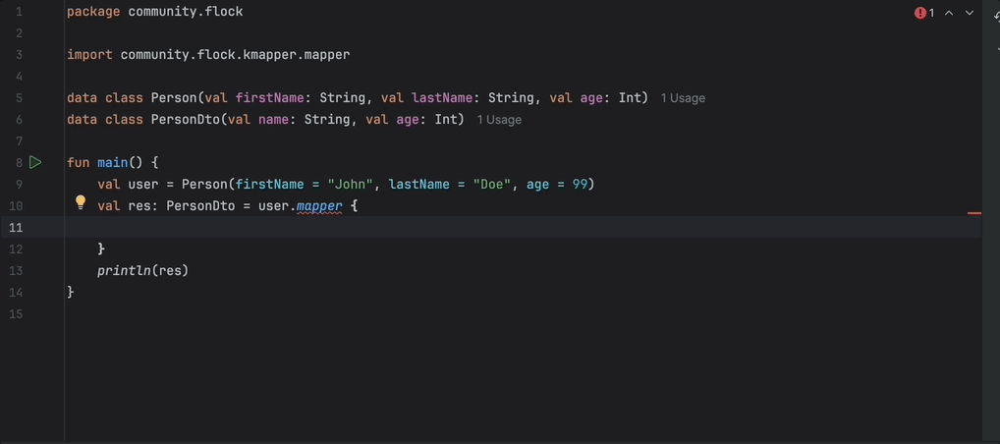

# KMapper

A Kotlin compiler plugin that automatically generates mapping methods between data classes using a fluent DSL.

## Overview

KMapper is a Kotlin compiler plugin that provides code generation capabilities for mapping between data classes. It uses a fluent DSL syntax with the `mapper` extension function to transform objects from one type to another, with compile-time validation to ensure all required constructor parameters are mapped.



## Features

- **Kotlin 2.0+ Support**: Built with K2 compiler support (Kotlin 2.2.20-RC)
- **Fluent DSL**: Intuitive mapping syntax with `to::property map value`
- **Compile-time Validation**: Ensures all required constructor parameters are mapped
- **IR-Based Generation**: Uses Kotlin's IR (Intermediate Representation) for robust code generation
- **Symmetric Enum Mapping**: When source and target enum entries share the same names, the plugin automatically maps them without additional configuration

## Requirements

- Kotlin 2.2.20-RC or later
- JVM 17+
- Gradle build system

## Installation

### Using Gradle

Add the plugin to your project's `build.gradle.kts`:

```kotlin
plugins {
    kotlin("jvm") version "2.2.20-RC"
    id("community.flock.kmapper") version "0.0.0-SNAPSHOT"
}

repositories {
    mavenCentral()
    maven(url="https://central.sonatype.com/repository/maven-snapshots/")
}
```

### Using Maven

Load the KMapper Maven integration by adding it as a dependency of kotlin-maven-plugin. The extension will:
- Auto-register the KMapper Kotlin compiler plugin (transitively on the plugin classpath)
- Ensure the runtime library (compiler-runtime) is on your project compile classpath

Kotlin version used/tested: 2.2.20-RC.

Minimal setup:

```xml

<dependencies>
  <dependency>
      <groupId>community.flock.kmapper</groupId>
      <artifactId>compiler-runtime</artifactId>
      <version>0.0.0-SNAPSHOT</version>
  </dependency>
</dependencies>

```

```xml
<build>
  <plugins>
    <plugin>
      <groupId>org.jetbrains.kotlin</groupId>
      <artifactId>kotlin-maven-plugin</artifactId>
      <version>2.2.20-RC</version>
        ...(other plugin configuration)
      <dependencies>
        <dependency>
          <groupId>community.flock.kmapper</groupId>
          <artifactId>compiler-plugin</artifactId>
          <version>0.0.0-SNAPSHOT</version>
        </dependency>
      </dependencies>
    </plugin>
  </plugins>
</build>
```


Troubleshooting:
- Ensure kotlin-maven-plugin version is 2.2.20-RC (matching our tested Kotlin version).
- Make sure the KMapper maven-plugin dependency is placed under kotlin-maven-plugin’s <dependencies> (not in the project <dependencies> section).
- In multi-module builds, add the kotlin-maven-plugin configuration in each module that compiles Kotlin (you can use <pluginManagement> in the parent for reuse).
- You can set a property <kmapper.version>0.0.0-SNAPSHOT</kmapper.version> and the extension will use it to resolve the runtime version if needed.

## Usage

### Basic Example

1. Import the mapper function:

```kotlin
import community.flock.kmapper.mapper
```

2. Define your data classes:

```kotlin
data class User(
    val id: Int, 
    val firstName: String, 
    val lastName: String, 
    val age: Int, 
    val active: Boolean
)

data class UserDto(
    val id: Int, 
    val name: String, 
    val age: Sting, 
    val active: Boolean = false
)
```

3. Use the mapper DSL to transform objects:

```kotlin
fun main() {
    val user = User("John", "Doe", 99, true)
    val userDto: UserDto = user.mapper {
        to::age map it.age.toString()
        to::name map "${it.firstName} ${it.lastName}"
        to::active.ignore()
    }
    println(userDto) // Output: UserDto(name=John Doe, age=99, active=false)
}
```

### Symmetric Enum Mapping

When your source and target enums have the same entry names, KMapper will map them automatically by name at compile time—no manual conversion needed.

Example:

```kotlin
enum class Status { NEW, ACTIVE, SUSPENDED }
data class User (val name: String, val status: Status)

enum class StatusDto { NEW, ACTIVE, SUSPENDED }
data class UserDto (val name: String, val status: StatusDto)

fun main() {
    val user = Source(name = "John Doe", status = SourceStatus.ACTIVE)
    val dto: UserDto = user.mapper { }
    println(dto) // UserDto(name=John Doe, status=ACTIVE)
}
```

### Generated Code

The plugin automatically generates the mapping implementation at compile time, replacing the `mapper` function call with the actual object construction code.


Notes:
- Symmetric enum mapping triggers when the target constructor parameter type is an enum and there is a source value of another enum with the same entry names.
- If names differ or you need custom mapping, you can still provide an explicit mapping expression: `to::status map when(it.status){ SourceStatus.NEW -> TargetStatus.NEW /* ... */ }`.

### IDE Support
The K2 Kotlin IntelliJ plugin supports running third party FIR plugins in the IDE, but this feature is hidden behind a flag.

To enable it, do the following:

- Enable K2 Mode for the Kotlin IntelliJ plugin.
- Open the Registry
- Set the kotlin.k2.only.bundled.compiler.plugins.enabled entry to false.